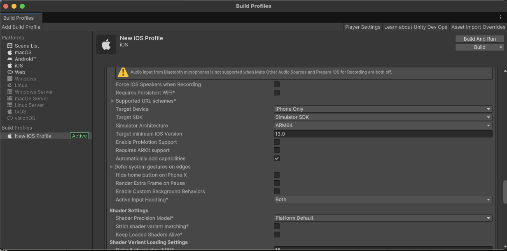
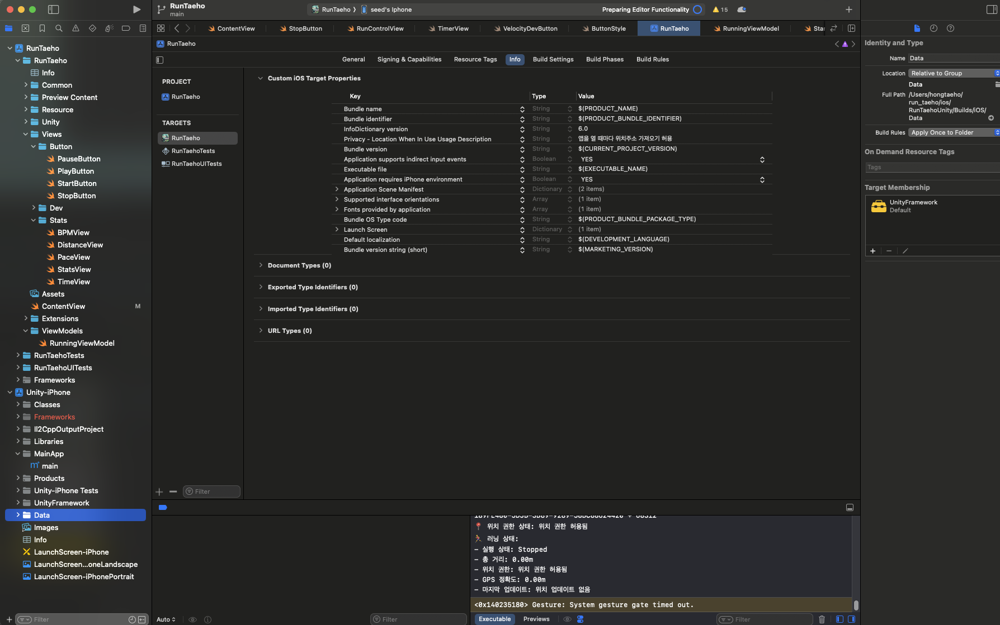

# Build 방법
## 1. Simulator 사용
### Unity
1. Build Profiles -> Target SDK -> Simulator SDK 선택

2. Build 선택 -> Build 파일 저장 위치 선택
3. XCode -> Unity 빌드 파일 -> Data 선택 후 우측의 Target Membership에 기존꺼 삭제후 UnityFramework 등록

